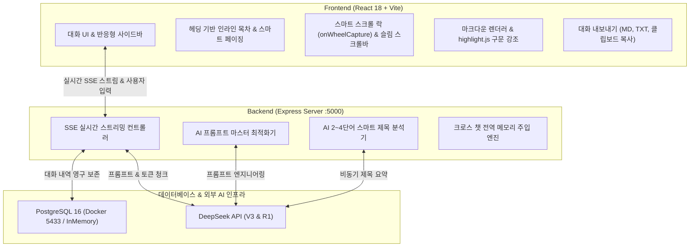

# 🤖 CloneGPT (ChatGPT 클론 코딩 풀스택 웹 서비스)

> **DeepSeek-V3 & R1 모델을 탑재한 상용 서비스급 ChatGPT 클론 코딩 웹 어플리케이션**  
> React + Node.js(Express) + PostgreSQL 풀스택 연동 및 실시간 SSE 스트리밍, 스마트 목차/페이징, 스크롤 락, 파일 분석, 대화 내보내기까지 완벽 구현.

---

## 📌 1. 프로젝트 개요
* **프로젝트명**: CloneGPT
* **목표**: 상용 ChatGPT와 최대한 유사한 모던 UI/UX와 사용 흐름을 제공하는 지능형 AI 웹 서비스 구현
* **핵심 가치**:
  * 외부 최신 AI API(DeepSeek API)의 실시간 SSE(Server-Sent Events) 스트리밍 파이프라인 구축
  * 헤딩(#, ##) 기반 스마트 페이징 및 인라인 텍스트 목차(TOC)를 통한 긴 응답 탐색성 극대화
  * 스트리밍 중 마우스 휠 감지 즉시 자동 스크롤을 멈추는 인간공학적 스크롤 락 (`onWheelCapture`)
  * 상용 서비스 수준의 대화 검색, 인라인 수정, 안전 삭제, 파일 첨부, 대화 내보내기, 슬림 스크롤바 디자인 완비

---

## 🛠️ 2. 기술 스택 (Tech Stack)

| 계층 | 기술 스택 | 설명 |
| :--- | :--- | :--- |
| **Frontend** | React 18, Vite, JavaScript (ES6+), CSS3 (Custom Design System), Lucide Icons | 반응형 ChatGPT 테마, SPA 고속 렌더링 |
| **Backend** | Node.js, Express, CORS, dotenv, Server-Sent Events (SSE) | 비동기 스트리밍 컨트롤러, RESTful API |
| **Database** | PostgreSQL 16 (Docker Compose), In-Memory Mock Fallback | 세션 및 메시지 영속화, 복원 아키텍처 |
| **AI Engine** | DeepSeek API (`deepseek-chat` 671B MoE / `deepseek-reasoner` R1) | 고속 코딩 및 단계별 추론(Reasoning) |
| **Markdown & Code** | `react-markdown`, `remark-gfm`, `highlight.js` (atom-one-dark) | 구문 강조, 복사, 숫자 취소선 방지 패치 |

---

## 🏗️ 3. 시스템 아키텍처 다이어그램



---

## 📅 4. 주차별 개발 일정 및 달성 내역

- [x] **1주차: 기획 및 환경 설계**
  - ChatGPT 화면 구성 및 핵심 사용자 흐름(User Flow) 분석
  - Frontend(React+Vite), Backend(Express), Database(PostgreSQL) 기술 스택 선정 및 아키텍처 설계
- [x] **2주차: 기본 환경 구성 & 주요 화면 개발**
  - Git / GitHub 원격 저장소 연동 및 기본 프로젝트 구조 셋업
  - PostgreSQL DB 스키마 설계 (`conversations`, `messages`) 및 Docker Compose 환경 구성
  - ChatGPT 스타일 사이드바, 환영 메인 화면, 메시지 버블 및 자동 높이 조절 입력창 개발
- [x] **3주차: AI 연동 & SSE 실시간 스트리밍 & 스마트 탐색 고도화**
  - DeepSeek 공식 API 연동 및 SSE 토큰 단위 타자기 효과 구현
  - 생성 중단(Abort) 및 다중 세션 백그라운드 스트리밍 보존 아키텍처 구축
  - 헤딩(#, ##) 기반 스마트 페이징 + 미니멀 텍스트 인라인 목차(TOC) 시스템 개발
  - 마우스 휠 1틱 감지 즉각 일시정지 `onWheelCapture` 기반 스마트 스크롤 락 및 최신 답변 플로팅 버튼 탑재
  - `highlight.js` 코드 문법 색상 강조 및 한국어 수치 범위 취소선 결함 패치 (`singleTilde: false`)
  - AI 2~4단어 스마트 대화 제목 자동 생성 & 크로스 챗 전역 메모리 & 프롬프트 마스터 탑재
- [x] **4주차: 전체 기능 통합, UI/UX 완성도 극대화 & 프로젝트 마무리**
  - 🔍 **사이드바 실시간 대화 검색**: 대화 제목 키워드로 과거 히스토리 즉각 필터링
  - ✏️ **인라인 대화 제목 수정 (Rename)**: 사이드바에서 제목을 즉시 편집하고 DB와 동기화
  - 🛡️ **ChatGPT 네이티브 인라인 삭제 확인**: 대화 제목을 보존하면서 `✔(확인)` / `✕(취소)` 및 `Esc` 단축키 지원
  - 📎 **텍스트 & 코드 파일 첨부 (Paperclip)**: `.txt`, `.py`, `.js`, `.json`, `.md` 등 파일 업로드 및 분석 + 이미지/바이너리 오첨부 방지 안내
  - 📥 **대화 내보내기 (Export)**: Markdown (.md), Text (.txt) 파일 다운로드 및 대화 전체 클립보드 복사
  - 🎨 **전역 커스텀 슬림 스크롤바 디자인**: 다크/라이트 테마 자동 적응, Firefox/Chrome 완벽 호환, `scrollbar-gutter` 적용
  - 🌟 **화면 내용 및 카피라이팅 고도화**: WelcomeScreen 카테고리 칩 및 현대적 추천 질문, 입력창 안내 문구, 사이드바 빈 상태 개선

---

## 🚀 5. 프로젝트 실행 가이드

### 사전 준비
- Node.js (v18 이상 권장)
- Docker Desktop (또는 로컬 PostgreSQL)

### 1) 데이터베이스 실행
```bash
docker compose up -d
```
> ※ 로컬 PostgreSQL이 구동 중이 아니더라도 Express 백엔드의 **자동 인메모리 폴백(Mock Mode)**이 작동하여 즉시 테스트할 수 있습니다.

### 2) 백엔드 서버 실행
```bash
cd server
npm install
npm run dev
```
- 서버 주소: `http://localhost:5000`
- 환경 변수 설정: `server/.env` 파일 생성 후 `DEEPSEEK_API_KEY=sk-...` 입력

### 3) 프론트엔드 클라이언트 실행
```bash
cd client
npm install
npm run dev
```
- 브라우저 접속: **`http://localhost:5173`**

---

## 🔌 6. 백엔드 REST API 명세서

| 메서드 | 엔드포인트 | 설명 |
| :--- | :--- | :--- |
| `GET` | `/api/health` | 서버 상태, DB 연결 상태, API 키 유무 헬스체크 |
| `GET` | `/api/config` | DeepSeek API 키 설정 여부 및 지원 모델 목록 조회 |
| `GET` | `/api/conversations` | 전체 대화방 목록 최신순 조회 |
| `POST` | `/api/conversations` | 신규 대화방 생성 |
| `GET` | `/api/conversations/:id` | 특정 대화방 상세 정보 및 메시지 히스토리 조회 |
| `PATCH` | `/api/conversations/:id` | 대화방 제목 변경 (인라인 수정) |
| `DELETE` | `/api/conversations/:id` | 대화방 및 관련 메시지 영구 삭제 |
| `POST` | `/api/conversations/:id/messages/stream` | **[핵심]** DeepSeek 실시간 SSE 스트리밍 메시지 발송 |
| `POST` | `/api/prompt/optimize` | AI 기반 전문가 프롬프트 마스터 변환 |

---

## 🌟 7. 핵심 기능 하이라이트

1. **실제 DeepSeek AI 두뇌 탑재**:
   - `deepseek-chat` (빠른 일상 대화 & 프로그래밍) 및 `deepseek-reasoner` (심층 추론 및 사고 과정 아코디언) 지원.
2. **헤딩 기반 스마트 페이징 & 인라인 TOC**:
   - 긴 답변을 논리적 섹션별로 분할하여 책처럼 넘겨보거나, 전체 보기 모드에서 부드러운 스크롤 이동 지원.
   - 사용자 선호 뷰(전체/페이지)를 `localStorage`에 영구 기억.
3. **인간공학적 스마트 스크롤 락 (`onWheelCapture`)**:
   - 초당 수십 개의 토큰이 출력되는 중에도 휠을 위로 올리는 순간 0.001초 만에 화면 강제 이동을 중단하여 이전 대화를 편안하게 열람.
4. **전역 커스텀 슬림 스크롤바**:
   - 브라우저 기본의 둔탁한 회색 스크롤바를 걷어내고, ChatGPT 스타일의 반투명 둥근 필 스크롤바를 모든 영역에 적용.
5. **완벽한 대화 관리 생태계**:
   - 실시간 대화 검색, 인라인 이름 수정, 실수 방지 삭제 확인, 파일 첨부 분석, Markdown/Text 내보내기 완비.
